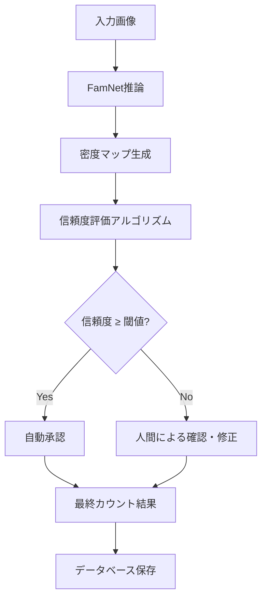
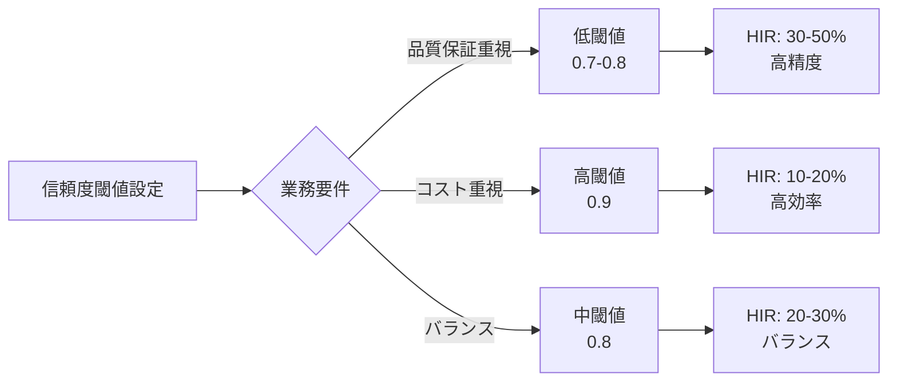

# Human-in-the-Loop ワークフロー解析手法

## 概要

本文書では、Few-Shot Counting（FSC）における実務的な運用を想定したHuman-in-the-Loopワークフローの設計と、その有効性を定量的に評価するための解析手法について詳述する。

---

## 1. ワークフローの全体設計

### 1.1 基本構造



### 1.2 システムの特徴

- **適応的介入**: 信頼度に基づいて選択的に人間が介入
- **効率性**: 不確実性の高い画像のみを確認
- **精度保証**: 低信頼度の結果を人間が検証
- **拡張性**: 閾値調整により運用方針を柔軟に変更可能

---

## 2. 信頼度評価アルゴリズム

### 2.1 信頼度スコアの算出

画像 $i$ に対する信頼度スコア $C_i$ を以下の式で定義する：

$$
C_i = w_1 \cdot S_{\text{uncertainty}} + w_2 \cdot S_{\text{similarity}} + w_3 \cdot S_{\text{consistency}}
$$

ここで、$w_1, w_2, w_3$ は重み係数（$w_1 + w_2 + w_3 = 1$）である。

### 2.2 各指標の定義

#### (a) 不確実性スコア $S_{\text{uncertainty}}$

密度マップ $D(x,y)$ の局所分散に基づく：

$$
S_{\text{uncertainty}} = 1 - \frac{\sigma_{\text{local}}}{\sigma_{\text{max}}}
$$

- $\sigma_{\text{local}}$: 密度マップの局所領域における標準偏差の平均
- $\sigma_{\text{max}}$: 正規化定数
- 高い分散 → 低い信頼度

**実装方法**:
```python
def calculate_uncertainty_score(density_map, window_size=16):
    """
    密度マップの局所的な不確実性を計算
    
    Args:
        density_map: 密度マップ (H x W)
        window_size: 局所領域のサイズ
    
    Returns:
        uncertainty_score: 不確実性スコア [0, 1]
    """
    local_variances = []
    for i in range(0, density_map.shape[0] - window_size, window_size):
        for j in range(0, density_map.shape[1] - window_size, window_size):
            patch = density_map[i:i+window_size, j:j+window_size]
            local_variances.append(np.var(patch))
    
    mean_variance = np.mean(local_variances)
    normalized_variance = mean_variance / (np.max(density_map) + 1e-8)
    uncertainty_score = 1 - normalized_variance
    
    return uncertainty_score
```

#### (b) 類似度スコア $S_{\text{similarity}}$

参照画像（Exemplars）との相関マップの最大値：

$$
S_{\text{similarity}} = \max_{x,y} \text{Corr}(F_{\text{query}}, F_{\text{exemplar}})
$$

- $F_{\text{query}}$: 入力画像の特徴マップ
- $F_{\text{exemplar}}$: 参照画像の特徴マップ
- 低い類似度 → 低い信頼度

**実装方法**:
```python
def calculate_similarity_score(correlation_map):
    """
    相関マップから類似度スコアを計算
    
    Args:
        correlation_map: FamNetが出力する相関マップ (H x W)
    
    Returns:
        similarity_score: 類似度スコア [0, 1]
    """
    max_correlation = np.max(correlation_map)
    # 正規化（相関値は通常[-1, 1]の範囲）
    similarity_score = (max_correlation + 1) / 2
    
    return similarity_score
```

#### (c) 一貫性スコア $S_{\text{consistency}}$

密度マップの統計的な一貫性：

$$
S_{\text{consistency}} = 1 - \frac{|\text{Peak}_{\text{max}} - \mu_{\text{peak}}|}{\text{Peak}_{\text{max}}}
$$

- $\text{Peak}_{\text{max}}$: 最大ピーク値
- $\mu_{\text{peak}}$: 全ピーク値の平均
- 異常に高いピーク → 低い信頼度

**実装方法**:
```python
def calculate_consistency_score(density_map, peaks):
    """
    密度マップのピーク一貫性を計算
    
    Args:
        density_map: 密度マップ (H x W)
        peaks: 検出されたピーク位置のリスト [(x1,y1), (x2,y2), ...]
    
    Returns:
        consistency_score: 一貫性スコア [0, 1]
    """
    if len(peaks) == 0:
        return 0.0
    
    peak_values = [density_map[y, x] for x, y in peaks]
    max_peak = np.max(peak_values)
    mean_peak = np.mean(peak_values)
    
    consistency_score = 1 - abs(max_peak - mean_peak) / (max_peak + 1e-8)
    
    return consistency_score
```

### 2.3 重み係数の設定

実験的に以下の重みを推奨：
- $w_1 = 0.4$ (不確実性)
- $w_2 = 0.4$ (類似度)
- $w_3 = 0.2$ (一貫性)

---

## 3. 比較実験の設計

### 3.1 比較対象ワークフロー

| ワークフロー | 説明 | 人間介入率 |
|------------|------|----------|
| **(A) 提案手法（適応的HITL）** | 信頼度ベースで選択的に人間が介入 | 変動（閾値依存） |
| **(B) 完全自動化** | すべてAIのみで処理 | 0% |
| **(C) 全数確認** | すべて人間が確認 | 100% |
| **(D) ランダムサンプリング** | ランダムにX%を人間が確認 | X%（例：20%, 50%） |

### 3.2 評価指標

#### 精度関連指標

**1. 平均絶対誤差（MAE: Mean Absolute Error）**

$$
\text{MAE} = \frac{1}{N} \sum_{i=1}^{N} |y_i - \hat{y}_i|
$$

- $y_i$: 正解カウント数
- $\hat{y}_i$: 予測カウント数
- $N$: 画像数

**2. 平均二乗誤差平方根（RMSE: Root Mean Square Error）**

$$
\text{RMSE} = \sqrt{\frac{1}{N} \sum_{i=1}^{N} (y_i - \hat{y}_i)^2}
$$

**3. 正解率（Accuracy within tolerance）**

$$
\text{Accuracy} = \frac{1}{N} \sum_{i=1}^{N} \mathbb{1}(|y_i - \hat{y}_i| \leq \tau)
$$

- $\tau$: 許容誤差（例：±2個）
- $\mathbb{1}$: 指示関数

#### 効率関連指標

**4. 人間介入率（HIR: Human Intervention Rate）**

$$
\text{HIR} = \frac{N_{\text{review}}}{N_{\text{total}}} \times 100\%
$$

- $N_{\text{review}}$: 人間が確認した画像数
- $N_{\text{total}}$: 全画像数

**5. 平均処理時間（APT: Average Processing Time）**

$$
\text{APT} = \frac{1}{N} \sum_{i=1}^{N} (t_{\text{AI}} + t_{\text{human},i})
$$

- $t_{\text{AI}}$: AI処理時間（一定）
- $t_{\text{human},i}$: 人間の確認・修正時間（介入時のみ）

**6. 修正頻度（Correction Rate）**

$$
\text{CR} = \frac{N_{\text{corrected}}}{N_{\text{review}}} \times 100\%
$$

- $N_{\text{corrected}}$: 実際に修正が行われた画像数

#### 総合指標

**7. 効率-精度比（Efficiency-Accuracy Ratio）**

$$
\text{EAR} = \frac{1 - \text{MAE}_{\text{normalized}}}{1 + \text{HIR}_{\text{normalized}}}
$$

- 高いほど効率と精度のバランスが良い

---

## 4. 実験プロトコル

### 4.1 実験手順

1. **データセット準備**
   - テストセット：100〜200画像を用意
   - 正解ラベル（Ground Truth）を事前に準備

2. **信頼度閾値の設定**
   - 閾値候補：$\theta \in \{0.5, 0.6, 0.7, 0.8, 0.9\}$

3. **各ワークフローでの処理**
   ```python
   for workflow in [A, B, C, D]:
       for image in test_dataset:
           # 推論実行
           prediction, confidence = model.predict(image)
           
           # ワークフローに応じた処理
           if workflow == 'A':  # 提案手法
               if confidence < threshold:
                   final_count = human_review(image, prediction)
               else:
                   final_count = prediction
           elif workflow == 'B':  # 完全自動化
               final_count = prediction
           elif workflow == 'C':  # 全数確認
               final_count = human_review(image, prediction)
           elif workflow == 'D':  # ランダムサンプリング
               if random.random() < sampling_rate:
                   final_count = human_review(image, prediction)
               else:
                   final_count = prediction
           
           # 評価指標の記録
           record_metrics(final_count, ground_truth, time, ...)
   ```

4. **結果の集計と可視化**
   - 各閾値における各指標を算出
   - トレードオフ曲線の描画

### 4.2 可視化方法

#### (1) 精度-効率トレードオフ曲線

```python
import matplotlib.pyplot as plt

fig, ax = plt.subplots(figsize=(10, 6))

for workflow in workflows:
    ax.plot(workflow['HIR'], workflow['MAE'], 
            marker='o', label=workflow['name'])

ax.set_xlabel('Human Intervention Rate (%)', fontsize=12)
ax.set_ylabel('Mean Absolute Error', fontsize=12)
ax.set_title('Efficiency-Accuracy Trade-off', fontsize=14)
ax.legend()
ax.grid(True, alpha=0.3)
plt.show()
```

#### (2) ROC曲線風の表現

横軸に人間介入率、縦軸に精度（1-MAE正規化）をプロット：

```python
# 提案手法の閾値を変えた場合の曲線
thresholds = [0.5, 0.6, 0.7, 0.8, 0.9]
HIRs = []
accuracies = []

for threshold in thresholds:
    HIR, accuracy = evaluate_with_threshold(threshold)
    HIRs.append(HIR)
    accuracies.append(accuracy)

plt.plot(HIRs, accuracies, 'o-', label='Proposed (Adaptive HITL)')
plt.xlabel('Human Intervention Rate (%)')
plt.ylabel('Accuracy (1 - Normalized MAE)')
plt.title('Performance Curve')
plt.legend()
plt.grid(True)
plt.show()
```

---

## 5. 期待される結果と考察

### 5.1 仮説

1. **提案手法（A）は、完全自動化（B）より高精度**
   - 低信頼度の画像を人間が修正することで誤差が減少

2. **提案手法（A）は、全数確認（C）より効率的**
   - 人間介入率が大幅に低減（例：20-40%）

3. **提案手法（A）は、ランダムサンプリング（D）より効果的**
   - 必要な箇所を選択的に確認するため、同じ介入率でより高精度

### 5.2 最適閾値の決定

業務要件に応じて閾値を選択：

- **高精度重視**：閾値 = 0.7〜0.8（HIR: 30-50%）
- **効率重視**：閾値 = 0.9（HIR: 10-20%）
- **バランス型**：閾値 = 0.8（HIR: 20-30%）

### 5.3 実務への示唆



---

## 6. 実装例（Python）

### 6.1 信頼度評価の統合

```python
import numpy as np

class ConfidenceEvaluator:
    def __init__(self, w1=0.4, w2=0.4, w3=0.2):
        self.w1 = w1  # 不確実性の重み
        self.w2 = w2  # 類似度の重み
        self.w3 = w3  # 一貫性の重み
    
    def evaluate(self, density_map, correlation_map, peaks):
        """
        総合的な信頼度スコアを計算
        
        Returns:
            confidence_score: [0, 1]の範囲の信頼度
        """
        s_uncertainty = self.calculate_uncertainty_score(density_map)
        s_similarity = self.calculate_similarity_score(correlation_map)
        s_consistency = self.calculate_consistency_score(density_map, peaks)
        
        confidence = (self.w1 * s_uncertainty + 
                     self.w2 * s_similarity + 
                     self.w3 * s_consistency)
        
        return confidence
    
    def calculate_uncertainty_score(self, density_map, window_size=16):
        # 前述の実装
        pass
    
    def calculate_similarity_score(self, correlation_map):
        # 前述の実装
        pass
    
    def calculate_consistency_score(self, density_map, peaks):
        # 前述の実装
        pass
```

### 6.2 ワークフローの実装

```python
class HITLWorkflow:
    def __init__(self, model, confidence_evaluator, threshold=0.8):
        self.model = model
        self.evaluator = confidence_evaluator
        self.threshold = threshold
        self.metrics = {
            'total_images': 0,
            'human_reviews': 0,
            'corrections': 0,
            'mae': [],
            'processing_times': []
        }
    
    def process_image(self, image, exemplars, ground_truth=None):
        """
        画像1枚を処理
        
        Returns:
            final_count: 最終的なカウント結果
            need_review: 人間の確認が必要だったか
        """
        import time
        start_time = time.time()
        
        # モデルで推論
        density_map, correlation_map, predicted_count = \
            self.model.predict(image, exemplars)
        
        # ピーク検出
        peaks = self.detect_peaks(density_map)
        
        # 信頼度評価
        confidence = self.evaluator.evaluate(
            density_map, correlation_map, peaks
        )
        
        # 閾値判定
        if confidence < self.threshold:
            # 人間による確認が必要
            final_count, corrected = self.human_review(
                image, density_map, predicted_count
            )
            need_review = True
            self.metrics['human_reviews'] += 1
            if corrected:
                self.metrics['corrections'] += 1
        else:
            # 自動承認
            final_count = predicted_count
            need_review = False
        
        # メトリクスの記録
        processing_time = time.time() - start_time
        self.metrics['total_images'] += 1
        self.metrics['processing_times'].append(processing_time)
        
        if ground_truth is not None:
            error = abs(final_count - ground_truth)
            self.metrics['mae'].append(error)
        
        return final_count, need_review, confidence
    
    def human_review(self, image, density_map, predicted_count):
        """
        人間による確認・修正（実際の実装では UI を表示）
        
        Returns:
            final_count: 修正後のカウント
            corrected: 修正が行われたか
        """
        # 実装例：可視化して人間が確認
        # ここでは簡略化のため、予測値を返す
        print(f"[Human Review] Predicted: {predicted_count}")
        # 実際にはGUIで確認・修正
        
        # 仮の実装
        final_count = predicted_count  # または人間が入力
        corrected = False  # 修正があったかどうか
        
        return final_count, corrected
    
    def detect_peaks(self, density_map, threshold=0.5):
        """
        密度マップからピークを検出
        """
        from skimage.feature import peak_local_max
        peaks = peak_local_max(density_map, min_distance=5, 
                               threshold_abs=threshold)
        return peaks
    
    def get_metrics(self):
        """
        評価指標を計算して返す
        """
        return {
            'MAE': np.mean(self.metrics['mae']),
            'HIR': (self.metrics['human_reviews'] / 
                   self.metrics['total_images'] * 100),
            'CR': (self.metrics['corrections'] / 
                  max(self.metrics['human_reviews'], 1) * 100),
            'APT': np.mean(self.metrics['processing_times'])
        }
```

### 6.3 実験の実行

```python
# 実験の実行例
def run_experiment(test_dataset, thresholds=[0.5, 0.6, 0.7, 0.8, 0.9]):
    results = []
    
    for threshold in thresholds:
        workflow = HITLWorkflow(
            model=famnet_model,
            confidence_evaluator=ConfidenceEvaluator(),
            threshold=threshold
        )
        
        for image, exemplars, ground_truth in test_dataset:
            workflow.process_image(image, exemplars, ground_truth)
        
        metrics = workflow.get_metrics()
        metrics['threshold'] = threshold
        results.append(metrics)
        
        print(f"Threshold: {threshold}")
        print(f"  MAE: {metrics['MAE']:.2f}")
        print(f"  HIR: {metrics['HIR']:.1f}%")
        print(f"  CR: {metrics['CR']:.1f}%")
        print()
    
    return results

# 実行
results = run_experiment(test_dataset)
```

---

## 7. まとめ

本ワークフロー解析手法により、以下が実現可能となる：

1. **定量的評価**: 精度と効率を数値で比較
2. **閾値最適化**: 業務要件に応じた最適設定の発見
3. **実務適用性の検証**: 人的コストと精度向上のバランス評価
4. **汎用性**: 他のFSC手法やドメインにも適用可能

この手法は、AIシステムの実務導入における重要な指針となり、特に工業現場での物体カウント業務において、自動化と人間の監督をバランスよく組み合わせた効率的な運用を実現する。

---

## 参考文献

[1] E. Brynjolfsson and A. McAfee, The second machine age: Work, progress, and prosperity in a time of brilliant technologies. WW Norton & company, 2014.

[2] S. Aich and I. Stavness, 'Improving object counting with heatmap regulation', arXiv preprint arXiv:1803.05494, 2018.

[3] V. Ranjan, U. Sharma, T. Nguyen, and M. Hoai, "Learning to count everything", in Proceedings of the IEEE/CVF Conference on Computer Vision and Pattern Recognition, 2021, pp. 3394–3403.

[4] A. Parnami and M. Lee, "Learning from few examples: A summary of approaches to few-shot learning", arXiv preprint arXiv:2203.04291, 2022.

[5] S. Van der Walt et al., "scikit-image: image processing in Python", PeerJ, vol. 2, p. e453, 2014.

[6] J. Jakubik, P. Hemmer, M. Vössing, B. Blumenstiel, A. Bartos, and K. Mohr, "Designing a human-in-the-loop system for object detection in floor plans", in Proceedings of the AAAI Conference on Artificial Intelligence, 2022, vol. 36, pp. 12524–12530.

