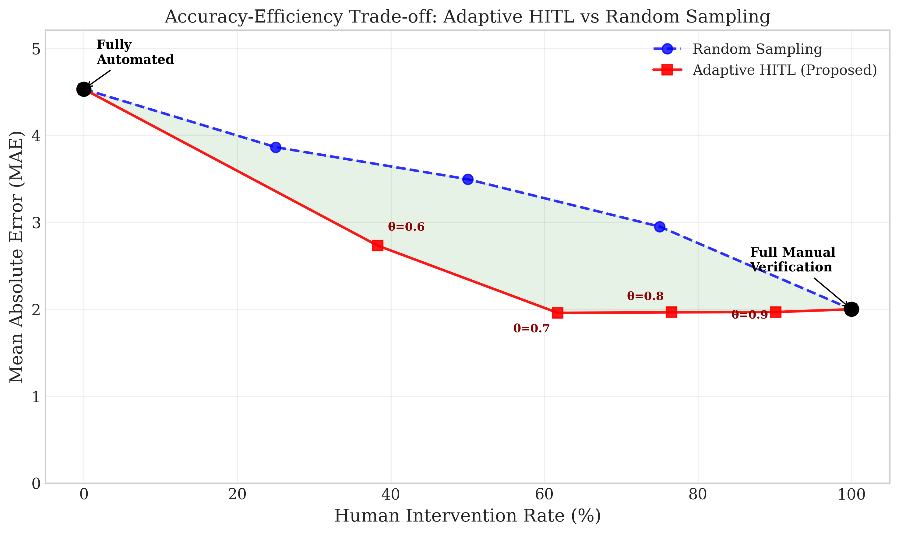

# Few-Shot Counting for Industrial Objects: An Adaptive Human-in-the-Loop Approach

**Authors:** Piyachet Pongsantichai, Fumitake Kato  
**Affiliation:** National Institute of Technology, Ibaraki College  
**Contact:** p.pongsantichai@gmail.com

## Abstract

Counting industrial objects remains challenging due to visual similarity, complex geometries, and environmental variability. Few-Shot Counting (FSC) reduces data requirements but cannot guarantee accuracy in all scenarios. We propose an adaptive Human-in-the-Loop (HITL) workflow with confidence-based selective verification that routes uncertain predictions for human review. Experiments on the INDT industrial dataset show that our approach achieves MAE of 1.959 at 62% human intervention, outperforming random sampling at 75% intervention (MAE 2.950). This framework enables practical deployment with tunable accuracy-efficiency trade-offs.

## 1. Introduction

Automated object counting is essential for inventory management and process optimization in industrial settings. Manufacturing facilities and warehouses routinely count structural components such as T-beams, L-beams, I-beams, and metal rods. These objects present significant identification challenges due to structural similarities and complex geometries. Conventional counting methods exhibit degraded performance under occlusions, shape variations, and cluttered arrangements typical of real-world environments.

Few-Shot Counting (FSC) addresses data scarcity by learning to count from minimal examples. FamNet [1] represents a notable approach in this domain, employing exemplar-based density map predictions that generalize to unseen object categories. However, FSC models cannot guarantee accurate predictions in all scenarios, particularly when images contain ambiguous regions, occlusions, or adverse lighting conditions.

This limitation motivates the present work. Rather than pursuing fully automated solutions, we propose a practical deployment strategy that leverages model efficiency while incorporating human judgment for uncertain cases. Our adaptive Human-in-the-Loop (HITL) workflow employs a confidence scoring mechanism to identify uncertain predictions, routing these cases for human verification while accepting high-confidence predictions automatically.

Our contributions include a confidence-based selective verification system combining density map variance and exemplar correlation scores, experimental validation demonstrating that adaptive HITL outperforms random sampling strategies, and the INDT dataset comprising 576 images of industrial objects along with practical deployment guidelines. Our code and dataset are available at https://github.com/Piyachetnoy/FSC-Rare-Ind.

## 2. Related Works

**Few-Shot Counting.** Few-Shot Counting has emerged as a solution for object counting with limited labeled data. Ranjan et al. [1] introduced FamNet, which learns to count objects using exemplar-based density map predictions with gradient-based test-time adaptation. Subsequent work has extended FSC capabilities: Amini-Naieni et al. [6] proposed CountGD, integrating visual exemplars with textual descriptions for open-world counting, while Pelhan et al. [7] unified point annotation, segmentation, and counting for structured object distributions. These advances demonstrate FSC's flexibility, though accuracy limitations in challenging scenarios remain.

**Human-in-the-Loop Systems.** HITL systems combine AI efficiency with human judgment for applications requiring high reliability. The core challenge lies in determining when human intervention is necessary: excessive intervention negates efficiency gains, while insufficient intervention compromises accuracy. Prior work has explored HITL frameworks in medical diagnosis, autonomous driving, and manufacturing quality control. Our work addresses this challenge through confidence-based selective verification, enabling adaptive intervention rates based on prediction uncertainty.

## 3. Methods

### 3.1 Few-Shot Counting with FamNet

This work employs FamNet [1] for density-based object counting. The architecture comprises a ResNet-50 feature extractor (pre-trained on ImageNet) and a density prediction module. Given a query image and exemplar bounding boxes, the model extracts regional features from exemplars and correlates them with query image features to generate density maps. The predicted count is obtained by integrating over the density map.

We train FamNet models from scratch on our industrial datasets rather than fine-tuning from pre-trained weights, enabling the model to learn features specific to industrial object characteristics. Training employs 70%/10%/20% train/validation/test splits with 100 epochs at learning rate $1\times10^{-6}$.

### 3.2 INDT Dataset

We constructed the INDT dataset for industrial object counting, comprising images of T-beams, L-beams, I-beams, and square bars collected from public sources [2,3,4]. Two versions were created: INDT-576 (576 images, 4 categories, average 17.6 objects per image) and INDT-409 (409 images, 3 categories, average 8.2 objects per image). Both datasets represent realistic industrial scenarios with varying lighting conditions, occlusions, and cluttered backgrounds. Annotations were created using PBAT (Point and Box Annotation Tool), a custom tool we developed for efficient FSC-compatible annotation with point markers for counting targets and bounding boxes for exemplar regions.

### 3.3 Confidence Score and Human-in-the-Loop Workflow

A critical innovation in our approach is the integration of a confidence-based selective verification system. For each processed image, we compute a confidence score reflecting the model's certainty in its prediction. This score is derived from two primary indicators:

**1. Density Map Local Variance.** We compute the local variance within regions surrounding each detected peak. High variance indicates ambiguous or noisy predictions, suggesting lower confidence. Conversely, low variance with clear, isolated peaks indicates high confidence.

**2. Exemplar Correlation Score.** We measure the correlation between the query image features and exemplar features in regions corresponding to detected objects. Higher correlation values indicate that detected objects closely match the exemplar characteristics, increasing confidence.

The overall confidence score $C$ for an image is computed as a weighted combination:

$$C = \alpha \cdot C_{\text{variance}} + \beta \cdot C_{\text{correlation}}$$

where $C_{\text{variance}}$ is normalized inverse variance (higher for lower variance), $C_{\text{correlation}}$ is the normalized correlation score, and $\alpha$ and $\beta$ are weighting coefficients summing to 1.

Based on this confidence score, we implement an adaptive HITL workflow:

- **High Confidence ($C > \theta$):** The model's prediction is accepted automatically without human verification.
- **Low Confidence ($C \leq \theta$):** The image and its predictions are flagged for human review, where an operator can correct the count or validate the prediction.

This selective intervention strategy balances accuracy and efficiency. By adjusting the threshold $\theta$, operators can control the trade-off between human workload and system accuracy.

## 4. Experiments

### 4.1 Experimental Setup

We evaluate using Mean Absolute Error (MAE) and Root Mean Squared Error (RMSE). For HITL evaluation, we additionally measure Human Intervention Rate (HIR) and estimated processing time (30 seconds per human-verified image based on preliminary studies).

### 4.2 Domain Training Effectiveness

Table 1 compares models on validation and test sets. The FSC-147 pre-trained model serves as baseline, while INDT-trained models use the same architecture trained from scratch on industrial data.

**Table 1: FamNet model comparison on INDT validation and test sets**

| Model | Val MAE | Val RMSE | Test MAE | Test RMSE |
|-------|---------|----------|----------|-----------|
| FSC-147 Pre-trained | 23.75 | 69.07 | 22.08 | 99.54 |
| Trained with INDT-576 | 10.90 | 18.61 | 9.501 | 13.81 |
| Trained with INDT-409 | 3.977 | 5.596 | 6.321 | 12.51 |

Domain-specific training yields substantial improvements: INDT-409 reduces test MAE by 71% compared to the pre-trained baseline. Notably, the INDT-409 model achieves superior performance despite fewer training images, suggesting that dataset quality and balance are more critical than quantity for FSC applications.

### 4.3 HITL Workflow Comparison

We compared four workflows on 81 test images using the INDT-409-trained model:

1. **Fully Automated:** All predictions accepted without verification
2. **Full Manual:** Every prediction reviewed by human
3. **Random Sampling:** Fixed percentage randomly selected for verification
4. **Adaptive HITL:** Confidence-based selective verification

**Table 2: Workflow comparison results (INDT-409 Test Set)**

| Workflow | MAE | RMSE | HIR (%) | Time (min) |
|----------|-----|------|---------|------------|
| Fully Automated | 4.530 | 6.556 | 0% | 0.3 |
| Random Sampling (25%) | 3.863 | 5.508 | 25% | 10.3 |
| Random Sampling (50%) | 3.494 | 5.050 | 50% | 20.3 |
| Random Sampling (75%) | 2.950 | 4.287 | 75% | 30.3 |
| Adaptive HITL ($\theta=0.6$) | 2.732 | 4.394 | 38% | 15.8 |
| Adaptive HITL ($\theta=0.7$) | 1.959 | 2.130 | 62% | 25.3 |
| Adaptive HITL ($\theta=0.8$) | 1.965 | 2.047 | 77% | 31.3 |
| Full Manual | 2.000 | 2.000 | 100% | 40.8 |

**Figure 1: Accuracy-Efficiency Trade-off Curves**

*MAE vs. Human Intervention Rate for different workflows. The adaptive HITL curve dominates random sampling at all intervention levels.*

The results demonstrate substantial advantages of adaptive HITL:

- **Comparable HIR:** Adaptive HITL ($\theta=0.6$) achieves MAE 2.732 at 38% HIR, significantly outperforming Random Sampling at 50% HIR (MAE 3.494)
- **Comparable accuracy:** Adaptive HITL ($\theta=0.7$) achieves MAE 1.959 at 62% HIR, surpassing Random Sampling at 75% (MAE 2.950)
- **Near-optimal accuracy:** Adaptive HITL ($\theta=0.7$) approximates Full Manual accuracy (MAE of approximately 2.0) while reducing human effort by 38%

The confidence-based approach concentrates human effort on genuinely difficult cases, whereas random sampling allocates effort inefficiently across both trivial and challenging cases.

**Figure 2: Density map visualization example (INDT-409-trained model)**

### 4.4 Practical Deployment Guidelines

Based on our experimental results, the following guidelines are recommended:

- **High accuracy requirements (MAE < 2):** Set $\theta=0.7$ or higher, accepting approximately 62% HIR
- **Balanced operation (MAE < 3):** Set $\theta=0.6$, requiring approximately 38% HIR  
- **High efficiency requirements (MAE < 5):** Employ fully automated workflow

These parameters can be adjusted according to operational priorities and cost constraints.

## 5. Conclusion

This paper presents an approach to industrial object counting that combines Few-Shot Counting with an adaptive Human-in-the-Loop workflow. The proposed confidence-based selective verification achieves superior accuracy-efficiency trade-offs compared to random sampling, attaining MAE of 1.959 at 62% human intervention versus MAE of 2.950 at 75% for random sampling.

The principal finding is that complete automation is not necessary for practical deployment. By intelligently routing uncertain cases to human verification, the system achieves near-optimal accuracy while substantially reducing human workload. The tunable threshold parameter enables flexible deployment across scenarios with varying accuracy requirements.

Future work will investigate automatic threshold adaptation based on human feedback and extension to more diverse industrial object categories.

## References

[1] Ranjan, V., Sharma, U., Nguyen, T., and Hoai, M. (2021). Learning To Count Everything. CVPR.

[2] Ernest (2025). Centring Sheet Dataset. Roboflow Universe.

[3] MetalPipeCounter (2024). Angles Dataset. Roboflow Universe.

[4] ROBOFUN (2025). Steel Beam Instance Segmentation Dataset. Roboflow Universe.

[5] van der Walt, S. et al. (2014). scikit-image: image processing in Python. PeerJ.

[6] Amini-Naieni, N., Han, T., and Zisserman, A. (2024). CountGD: Multi-Modal Open-World Counting. NeurIPS.

[7] Pelhan, J., Lukežič, A., Zavrtanik, V., and Kristan, M. (2024). A Novel Unified Architecture for Low-Shot Counting by Detection and Segmentation. NeurIPS.
