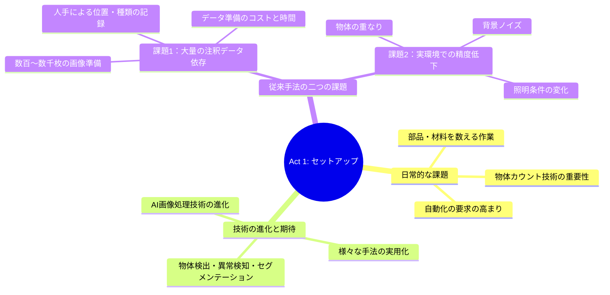
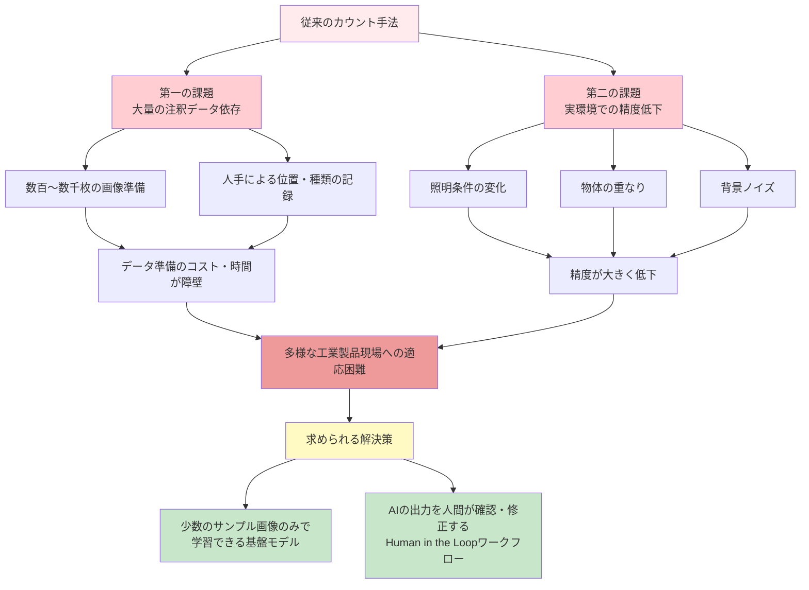
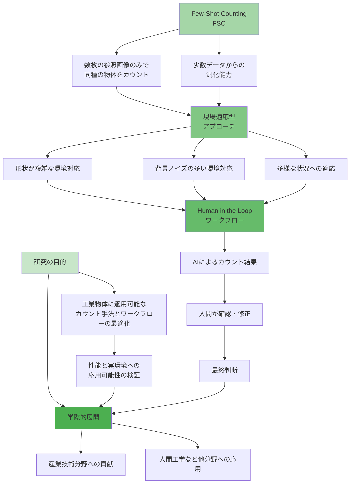
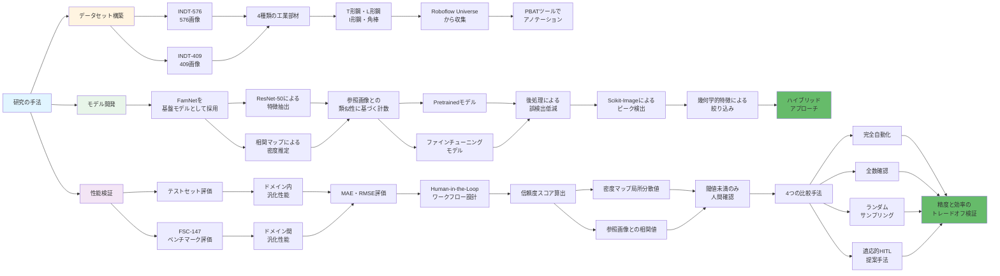
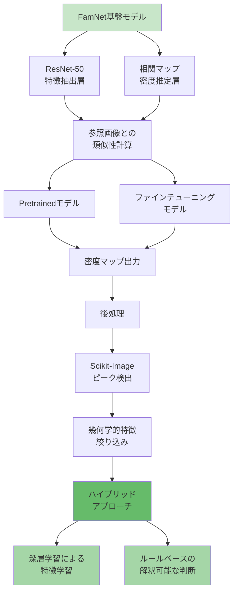
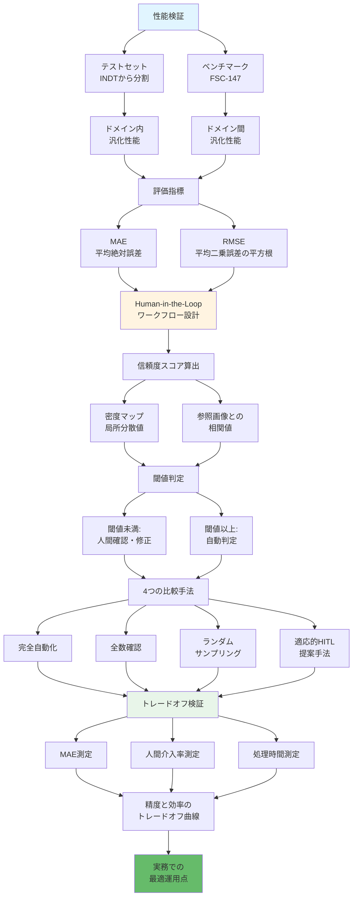
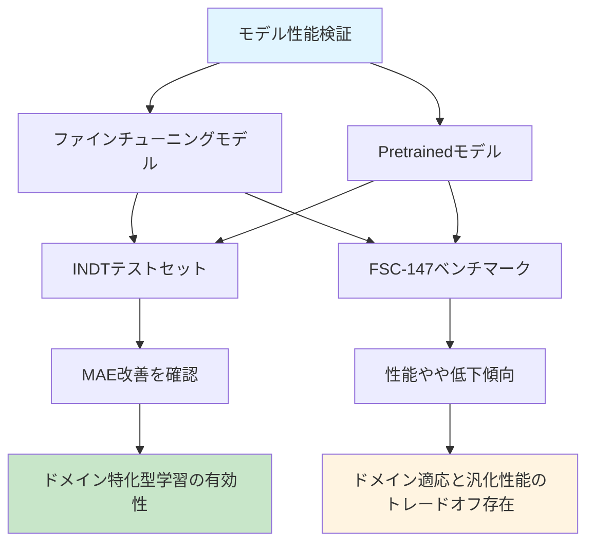
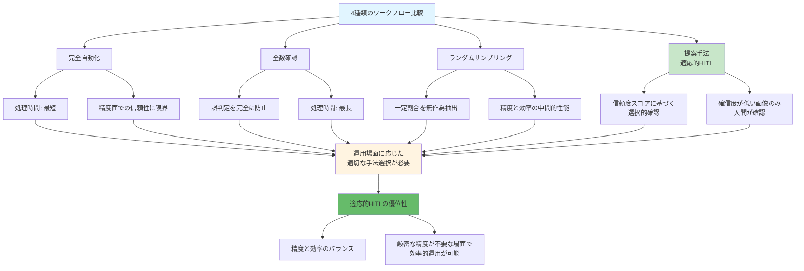
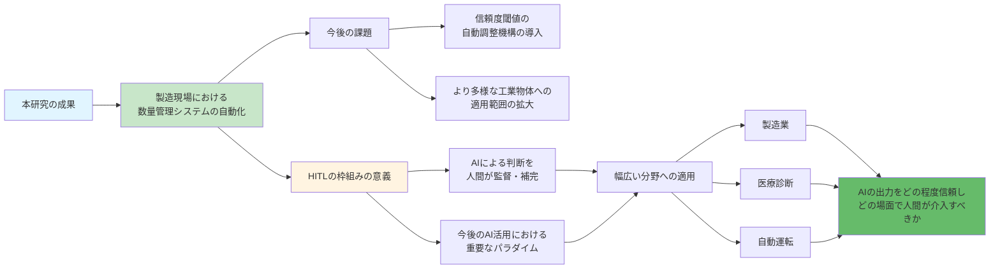

> **⚠️ 重要ルール**: 
> - このファイルは `成果の要旨_PIYACHET.md` を読者が読んだ際の理解を反映する必要があります
> - 情報が不足している部分は「情報不足」と明記してください
> - 追加の文脈や情報を加えないでください
> - このファイルは現在のストーリーテリングの進行状況を追跡するために使用されます

# 成果の要旨：Three-Act構造による物語的まとめ

**研究テーマ**: Few-Shot Counting for Custom Industrial Objects  
**研究者**: PONGSANTICHAI PIYACHET  
**所属**: 茨城工業高等専門学校 専攻科産業技術システムデザイン工学専攻

## Three-Act構造の全体像

---

## Act 1: セットアップ — 製造現場の現実

### 日常的な課題
メーカーなどの生産現場における製品検査や品質管理では、部品や材料の管理において「数える」という作業が多く発生する。特に製造業においては、自動化の要求が急速に高まっており、部材の数量管理において物体カウント技術の重要性が増している[1]。

### 技術の進化と期待
こうした背景のもと、人工知能（以下、AI）による画像処理技術は大いに進化し、物体検出、異常検知、画像セグメンテーションなど様々な手法が実用化されてきた。

### 従来手法の二つの課題
しかしながら、このような従来の物体検出によるカウント手法には、大きく二つの課題が存在する。

**第一の課題：大量の注釈データやドメイン依存性**  
新しい製品や環境に対応するたびに、対象物が写った画像を数百から数千枚準備し、それぞれに対して物体の位置や種類を人手で記録する必要がある[2]。このため、多様な工業製品を扱う現場では、データ準備のコストと時間が大きな障壁となり、適応が困難である。

**第二の課題：実環境における正確性と信頼性の問題**  
生産ラインなど、部品が流れてくる照明の当て方と配置角度が厳密に管理されている環境では一定の性能が得られるものの、室外や倉庫などの現場環境では、照明条件の変化、物体の重なり、背景ノイズなどにより、その精度は大きく低下する。

このような課題に対して、少数のサンプル画像のみで学習できる基盤モデルおよび、AIの出力を人間が確認・修正するHuman in the Loopの思考に基づくワークフローが必要であると考える[4][6]。

---

## Act 2: 対立 — 従来技術の限界

### 第一の課題：大量の注釈データ依存とドメイン依存性
従来の物体検出によるカウント手法は、大量の注釈データやドメイン依存性を前提としている[2]。すなわち、新しい製品や環境に対応するたびに、対象物が写った画像を数百から数千枚準備し、それぞれに対して物体の位置や種類を人手で記録する必要がある。このため、多様な工業製品を扱う現場では、データ準備のコストと時間が大きな障壁となり、適応が困難である。

### 第二の課題：実環境における正確性と信頼性の問題
生産ラインなど、部品が流れてくる照明の当て方と配置角度が厳密に管理されている環境では一定の性能が得られるものの、室外や倉庫などの現場環境では、照明条件の変化、物体の重なり、背景ノイズなどにより、その精度は大きく低下する。

### 求められる解決策
このような課題に対して、少数のサンプル画像のみで学習できる基盤モデルおよび、AIの出力を人間が確認・修正するHuman in the Loopの思考に基づくワークフローが必要であると考える[4][6]。

---

## Act 3: 解決 — Few-Shot Countingによる革新

### 研究の目的
本学修・探究の目的は、工業物体に適用可能なカウント手法とワークフローを最適化し、その性能と実環境への応用可能性を検証することである。ここでいう「工業物体（Industrial Objects）」とは、鋼材や部品など製造現場で扱われる対象物を指し、「ワークフロー」とは、AIによるカウント結果を人間が確認・修正し、最終判断を下すまでの一連の作業手順を意味する。

### 突破口の発見：Few-Shot Counting（FSC）
上記の二つの課題を克服するため、少数データからの汎化能力に優れたFew-Shot Counting（FSC）に着目した[3][4]。FSCは、従来手法とは異なり、カウント対象の物体が写った参照画像を数枚用意するだけで、画像中の同種の物体を数えることができる技術である。

### 現場適応型アプローチの構築
このFSCを基盤としつつ、形状が複雑で背景ノイズの多い現場環境においても、わずかなサンプル画像から学習し、多様な状況に適応できる現場適応型のカウント手法およびそのワークフローを構築したいと考えている。

### 学際的展開の可能性
こうした課題に対応する技術として、本テーマは産業技術分野の一助となるだけでなく、人間工学など他分野への応用も視野に入れた学際的展開が可能であり、学修の集大成にふさわしいと判断した。

---

## エピローグ：学修の集大成として

こうした課題に対応する技術として、本テーマは産業技術分野の一助となるだけでなく、人間工学など他分野への応用も視野に入れた学際的展開が可能であり、学修の集大成にふさわしいと判断した。

---

# 研究の手法・方法論

本研究は、データセット構築、モデル開発、性能検証の三段階で構成される。

## データセット構築

工業物体に特化したデータセットINDT-576（576画像）およびその部分集合INDT-409（409画像）を構築した。対象物として、形状が類似し識別が困難なT形鋼、L形鋼、I形鋼、角棒の4種類の工業部材を選定し、公開データソースRoboflow Universeから画像を収集した。アノテーション作業では、独自開発したツールPBATを用いてFSCモデルの学習に適したデータ形式への変換を行い、各物体の位置情報を効率的に付与した。

## モデル開発

FSC手法の一つであるFamNet[3]を基盤モデルとして採用した。FamNetは、ResNet-50による特徴抽出層と相関マップによる密度推定層から構成され、数枚の参照画像（Exemplars）との類似性に基づいて対象物を計数する。学習には、FamNetの事前学習済みモデル（Pretrainedモデル）をINDTデータセットで再学習（ファインチューニング）したモデルを構築し、比較対象として元のPretrainedモデルとの性能差を検証した。

さらに、FamNetの密度マップ出力に対して後処理を施し、背景ノイズや物体の重なりによる誤検出を低減した。具体的には、画像処理ライブラリScikit-Image[5]のピーク検出アルゴリズムを適用して物体中心の候補点を抽出し、幾何学的特徴に基づく規則的な絞り込みを行った。これにより、深層学習による特徴学習と、ルールベースの解釈可能な判断を統合したハイブリッドアプローチを実現した。

## 性能検証

構築した両モデルをINDTデータセットから事前に分割したテストセット（学習時には使用していない未見の画像）および工業物体以外の多様な対象を含むベンチマークデータセットFSC-147[3]に適用し、ドメイン内およびドメイン間での汎化性能を評価した。評価指標には、平均絶対誤差（MAE）および平均二乗誤差の平方根（RMSE）を用いた。

さらに、実務での運用を想定し、Human-in-the-Loopのワークフローを設計した[6]。このワークフローでは、密度マップの局所分散値と参照画像との相関値を組み合わせた信頼度スコアを算出し、このスコアが閾値未満の画像のみを人間が確認・修正する仕組みを実装した。ワークフローの有効性検証では、(1)完全自動化、(2)全数確認、(3)ランダムサンプリング、(4)提案手法（適応的HITL）の4つの比較手法を設定し、それぞれについてMAE、人間介入率、処理時間を測定した。信頼度閾値を段階的に変化させることで精度と効率のトレードオフ曲線を描き、実務での最適な運用点を明らかにした。

## 実装

実装にはPythonおよび深層学習フレームワークPyTorchを用い、最終的な成果物として、学術論文、ソースコード、データセットをGitHubリポジトリで公開した。

---

# 得られた結果と考察，将来展望

## モデル性能の検証結果

INDTデータセットでファインチューニングを行ったモデルは、事前学習済みモデル（Pretrainedモデル）と比較して、工業物体のカウントタスクにおいて優れた性能を示した。具体的には、テストセットにおけるMAEが改善し、ドメイン特化型の学習が有効であることが確認された。一方、汎用ベンチマークFSC-147では、ファインチューニングモデルの性能がやや低下する傾向が見られ、ドメイン適応と汎化性能のトレードオフが存在することが示唆された。

## ワークフロー比較検証結果

構築したファインチューニングモデルを用いて、4種類のワークフローを比較検証した。各手法の特性は以下のとおりである。

**(1) 完全自動化**: 処理時間は最短であるが、モデルの誤判定をそのまま出力するため、精度面での信頼性に限界がある。

**(2) 全数確認**: すべての出力を人間が確認するため、モデルの誤判定を完全に防止できるが、処理時間が最も長くなる。

**(3) ランダムサンプリング**: 一定割合の画像を無作為に抽出して確認する手法であり、精度と効率の中間的な性能を示す。

**(4) 提案手法（適応的HITL）**: 信頼度スコアに基づき、モデルの確信度が低い画像のみを選択的に人間が確認する。

上記の結果から、最適なワークフローは一意に決まるものではなく、運用場面に応じて適切な手法を選択すべきであることが明らかとなった。提案する適応的HITLは、信頼度の閾値設定に依存するものの、精度と効率のバランスにおいて優位性を示した。特に、厳密な数値精度が求められない場面では、完全自動化や全数確認よりも効率的な運用が可能である。

## 将来展望

本研究の成果は、製造現場における数量管理システムの自動化に寄与するものである。今後は、信頼度閾値の自動調整機構の導入や、より多様な工業物体への適用範囲の拡大が課題となる。また、本研究で提案したHuman-in-the-Loopの枠組みは、AIによる判断を人間が監督・補完するという、今後のAI活用における重要なパラダイムを示唆している。AIの出力をどの程度信頼し、どの場面で人間が介入すべきかという問いは、製造業に限らず、医療診断や自動運転など幅広い分野に共通する課題であり、本研究の知見がその議論に貢献することを期待する。

---

# 不足情報

以下のセクションは、元のファイル `成果の要旨_PIYACHET.md` では「[空白]」となっており、読者にとって情報が不足している部分です。

## 履修計画書からの変更

**情報不足**: 元のファイルでは「[空白]」となっており、履修計画書から変更があった場合の理由および履修計画書に対する評価・コメントへの対応については記載されていない。

## 学修全体について

**情報不足**: 元のファイルでは以下のセクションがすべて「[空白]」となっている：
- テーマの学修・探究の基盤となる専門科目の学修
- テーマの学修・探究に関係する関連科目の学修
- 専攻に係る科目以外の学修
- 自分自身の４年間の学修全体の省察

読者は、この研究がどのような学修の基盤の上に成り立っているか、どのような関連科目と結びついているかについては情報が不足している。

---

# 参考文献

[1] E. Brynjolfsson and A. McAfee, The second machine age: Work, progress, and prosperity in a time of brilliant technologies. WW Norton & company, 2014.

[2] S. Aich and I. Stavness, 'Improving object counting with heatmap regulation', arXiv preprint arXiv:1803. 05494, 2018.

[3] V. Ranjan, U. Sharma, T. Nguyen, and M. Hoai, "Learning to count everything", in Proceedings of the IEEE/CVF Conference on Computer Vision and Pattern Recognition, 2021, pp. 3394–3403.

[4] A. Parnami and M. Lee, "Learning from few examples: A summary of approaches to few-shot learning", arXiv preprint arXiv:2203. 04291, 2022.

[5] S. Van der Walt et al., "scikit-image: image processing in Python", PeerJ, vol. 2, p. e453, 2014.

[6] J. Jakubik, P. Hemmer, M. Vössing, B. Blumenstiel, A. Bartos, and K. Mohr, "Designing a human-in-the-loop system for object detection in floor plans", in Proceedings of the AAAI Conference on Artificial Intelligence, 2022, vol. 36, pp. 12524–12530.
